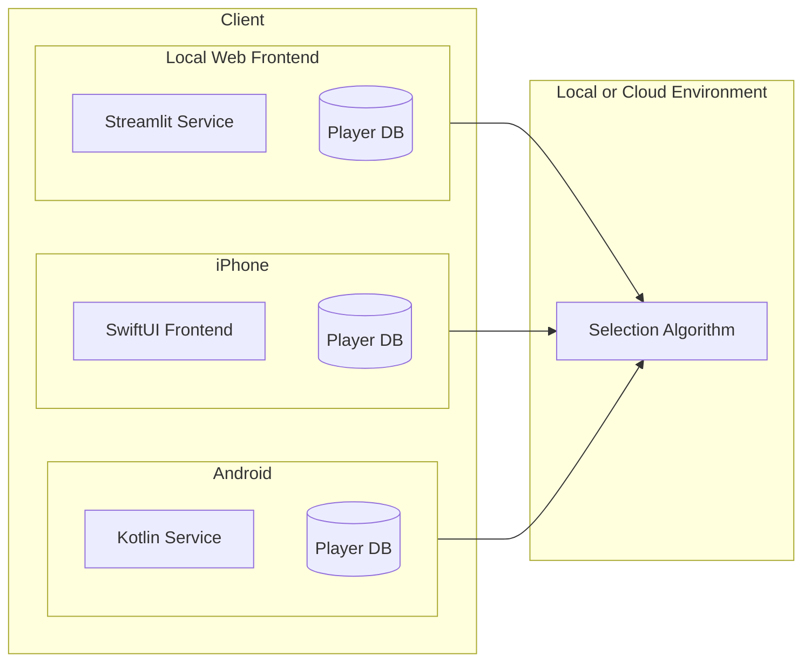

```mermaid
flowchart LR
    subgraph client[Client]
        subgraph local_frontend[Local Web Frontend]
            SF[Streamlit Service]
            SDB[(Player DB)]
        end
        subgraph iPhone
            IF[SwiftUI Frontend]
            IDB[(Player DB)]
        end
        subgraph Android
            AF[Kotlin Service]
            ADB[(Player DB)]
        end
    end

    subgraph Backend[Local or Cloud Environment]
        BE[Selection Algorithm]
    end

    local_frontend --> BE
    iPhone --> BE
    Android --> BE
```